# JWT signin algorithm confusion
 
This document contains information on how to perform an algorithm confusion attack on JWT token signing.

## JWT (Json Web Token)

Is an open standard (RFC 7519) commonly used in authentication processes because enables the secure exchange of data between applications or services, ensuring that it is valid and secure.

A JWT token has the following structure:

- **Header**: contains information about the token type and the algorithm used.

- **Payload**: contains the data to be shared, such as the user ID, names, emails, permissions, etc.

- **Signature**: is a hash created from the header, payload, and a private key, which guarantees that the header or payload data has not been modified after the token was signed.

It is important to note that the JWT should not contain sensitive data in its payload section, as the token is not encrypted and all of its contents can be viewed, for example, using the jwt.io website.

> **!NOTE**:
> A JWT token may not be signed, but it is not secure because there is no guarantee that the data has not been modified since the token was created.

## Attack description

Even if a JWT token is signed with secure keys, it can still be vulnerable to attacks if the server configuration is not adequate. In this case, the attack consists of changing the encryption algorithm to a less secure one, which is possible with an incorrect server configuration.

### Scenario

To carry out this attack, [this Portswigger lab](https://portswigger.net/web-security/jwt/algorithm-confusion/lab-jwt-authentication-bypass-via-algorithm-confusion) will be used.

It consists of a server that issues JWT tokens signed with a robust RSA key pair and performs token validation to accept requests, implementing the OAuht2.0 and OpenId Connect standards, but it contains an error in the token validation configuration that allows this attack.

### Required tools

Any tool that allows you to intercept calls, such as:

- [Burpsuite](https://portswigger.net/burp)
- [HttpToolkit](https://httptoolkit.com/)
- [Caido](https://caido.io/)

Any tool for generating cryptographic keys, such as:
- Openssl
- JWT Editor (Burpsuite extension)

In this case, we will use the Burpsuite tool, as it allows us to intercept calls and, using the JWT editor extension, generate the keys needed to carry out the attack.

### Steps

#### 1 - Create temporal burpsuite project

When you open the Burpsuite tool, a project may be created. You can select the temporary in-memory project option:

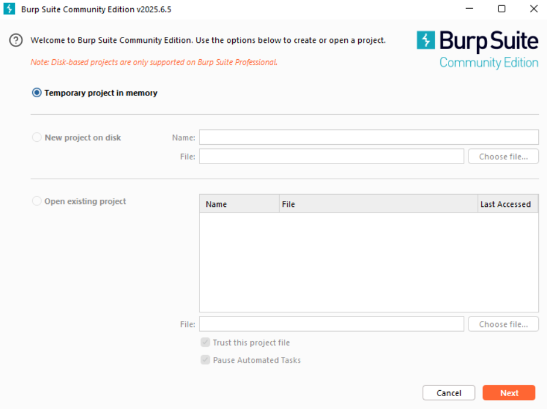

Once the project has been created, go to the “Proxy” tab and then to the proxy settings:

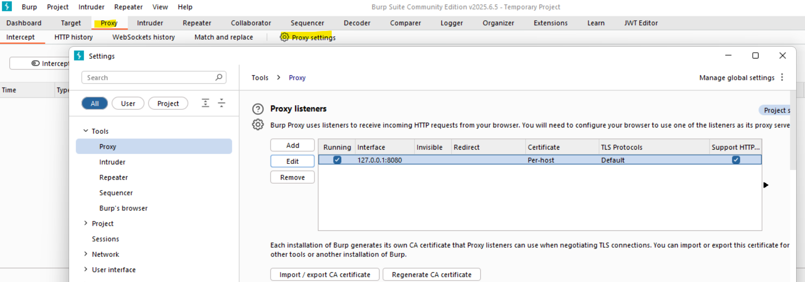

Next, select the active listener and click the Edit button to disable support for HTTP/2:

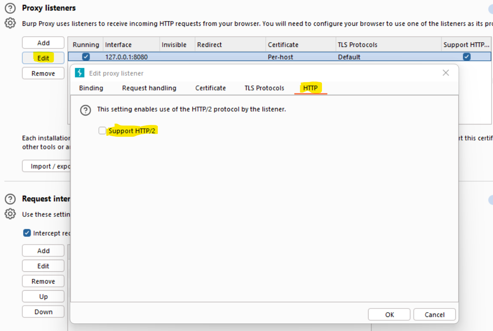

Finally, open the browser integrated into the tool itself from the proxy tab and navigate to the lab URL:

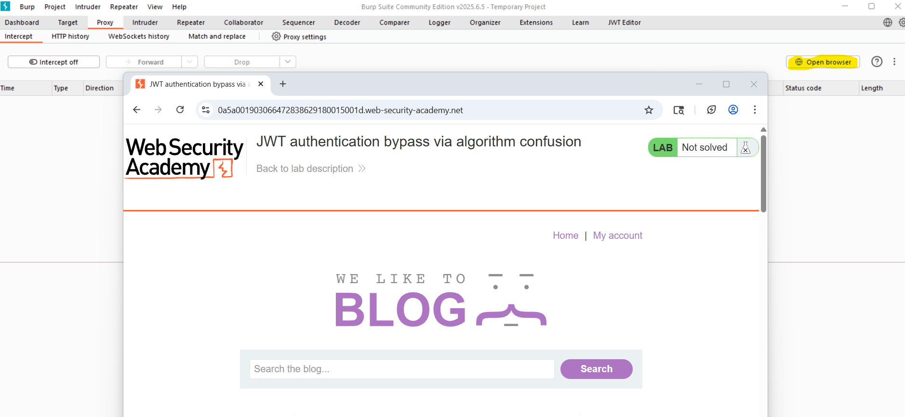

#### 2 - Generate a valid JWT token.

To generate a JWT token, we log in to the lab application with the credentials: `wiener/peter`:

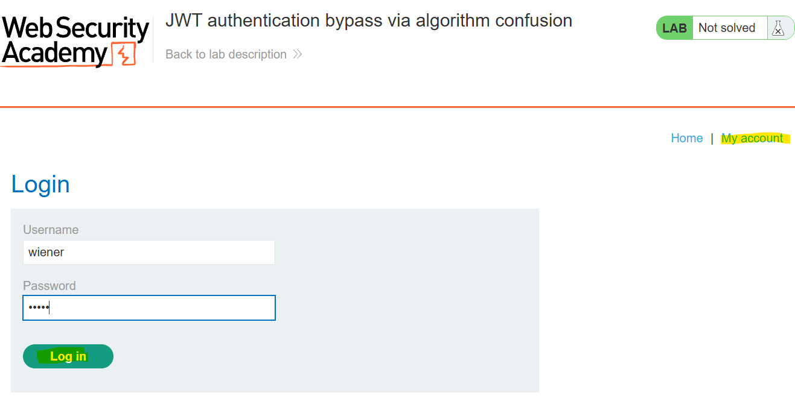

Next, in the HTTP History tab, select the login request and send it to the Burp repeater:

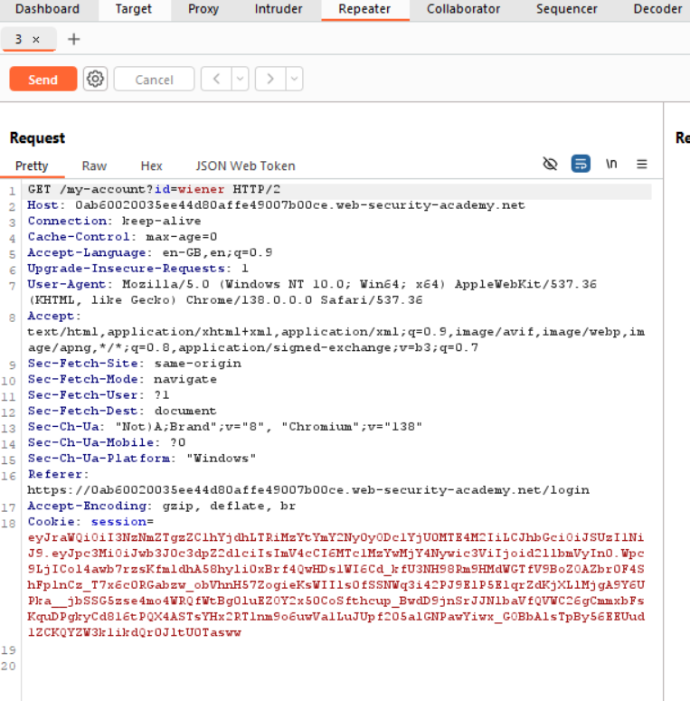

In the Repeater tab, change the request URL to /Admin:

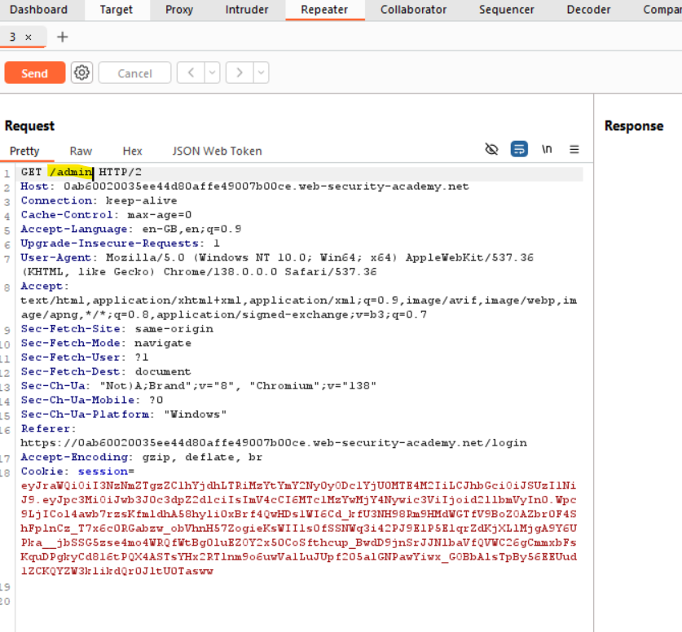

In the Json Web Token tab we can see the token:

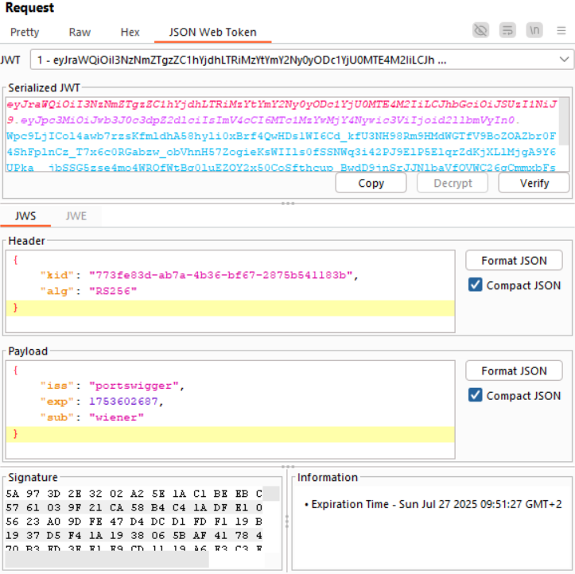

Later on, we will modify this token to carry out the attack.

#### 3 - Obtains the public key

OAuth2.0 and OpenId Connect implementations can expose an endpoint (./jwks) for sharing public keys.

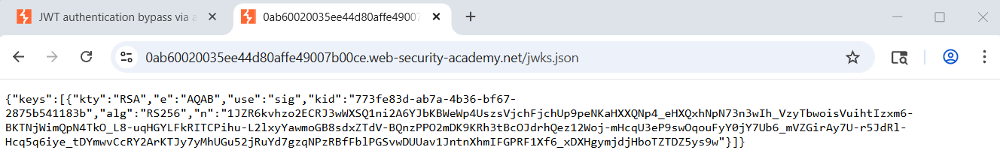

In a variant of this attack, when this endpoint is not accessible, we can obtain the public key from two JWT tokens issued by the server.

#### 4 - Create a RSA key

In the JWT editor add-on, we will create a new RSA key using the public key:

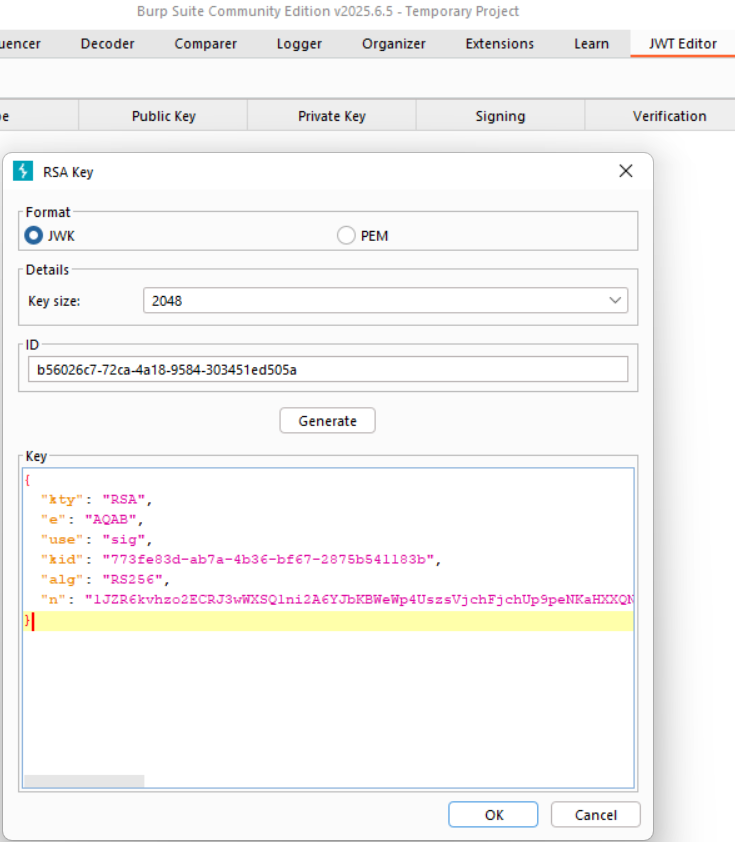

Next, right-click on the key entry you just created and select **Copy Public Key as PEM**. Next, on the Decoder tab, we will encode the PEM content as base64:

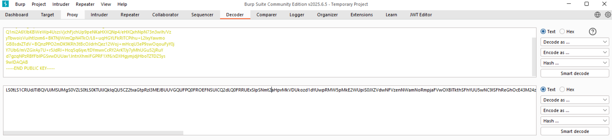

#### 5 - Create a symmetric key

Now, we will create a symmetric key and we will replace de 'k' property with the PEM enconded to base64 of the previous step:

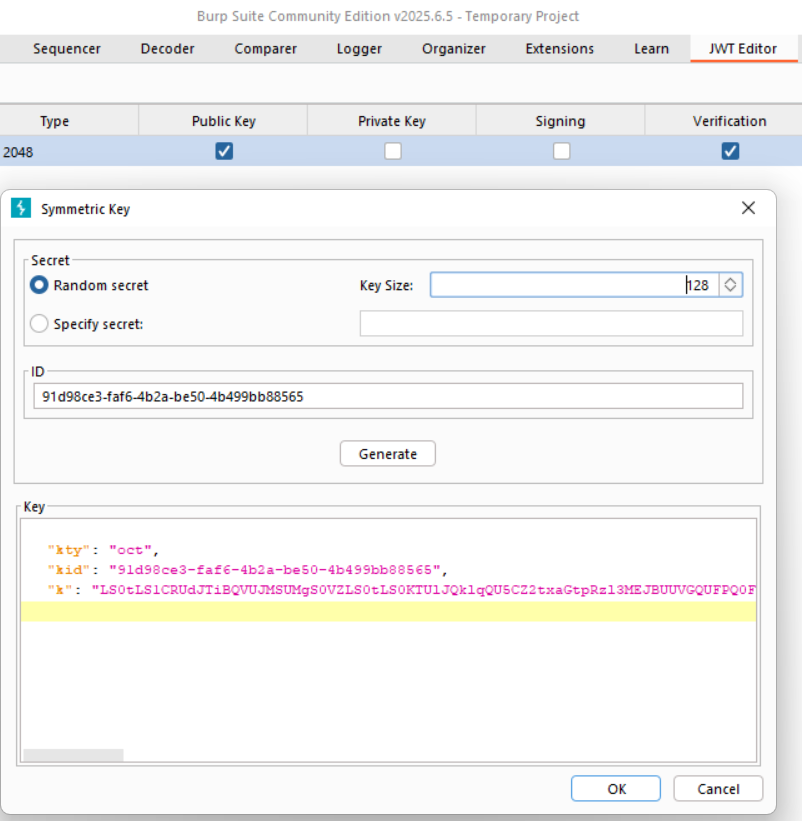

#### 6 - Modify and signin the token

Go back to the Repeater tab we will modify the JWT token, changing the 'alg' to HS256 value in the header section and 'sub' to administrator in the payload section:

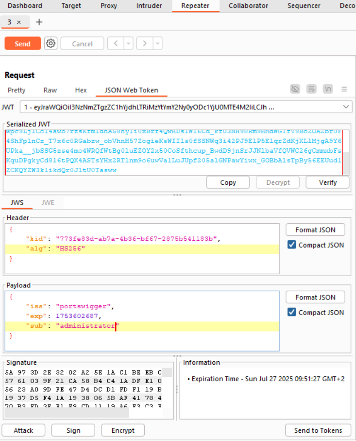

Next, sign the token with the symmetric key:

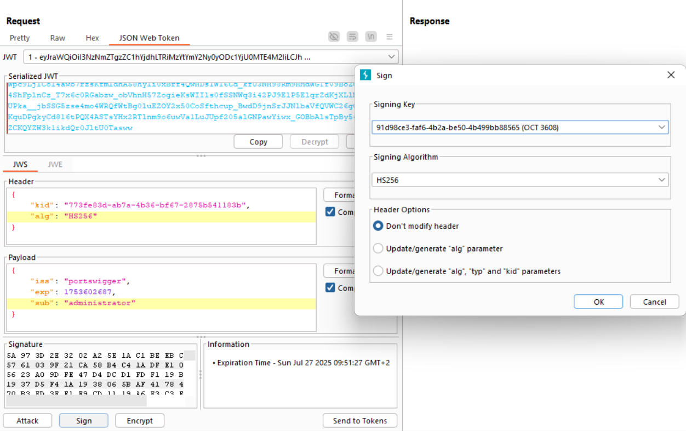

Next, send the request and now we can see the admin panel:

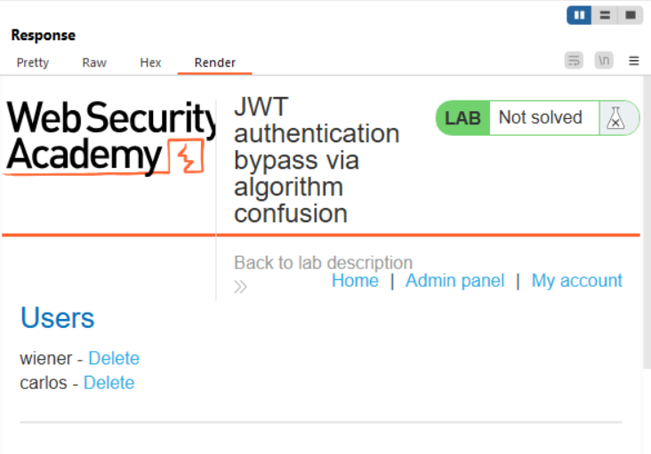

Delete the user Carlos to solve the lab:

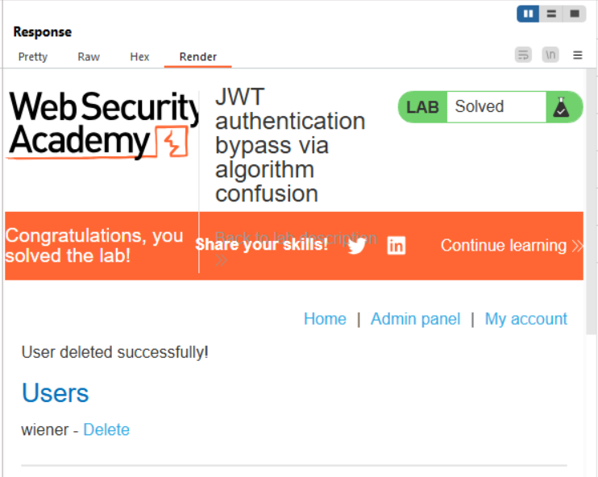

### How to avoid the attack

We were able to carry out this attack because the OpenId Connect configuration allows insecure algorithms to sign its tokens. To prevent this attack, make sure that only the RS256 algorithm is allowed and that any token with a different signing algorithm is rejected.

Other recommendations are:

- Do not use symmetric algorithms as public keys or secrets.
- Always validate other metadata, such as iss, aud, exp, and kid.